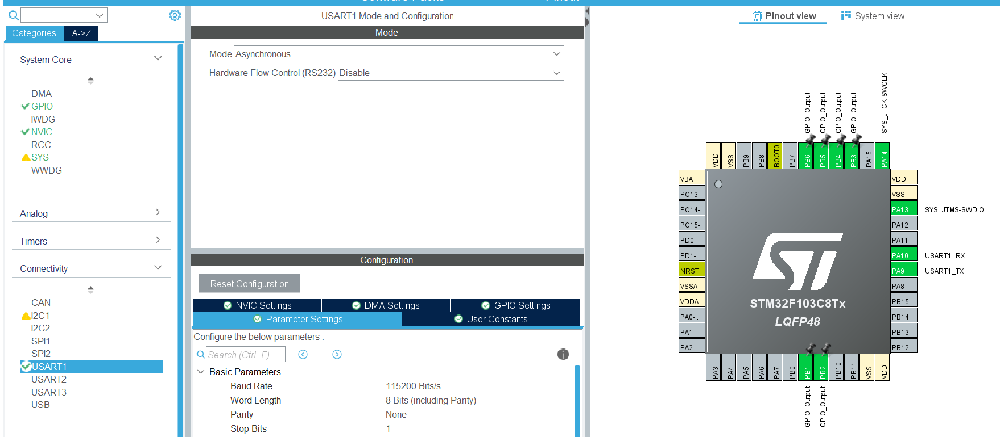
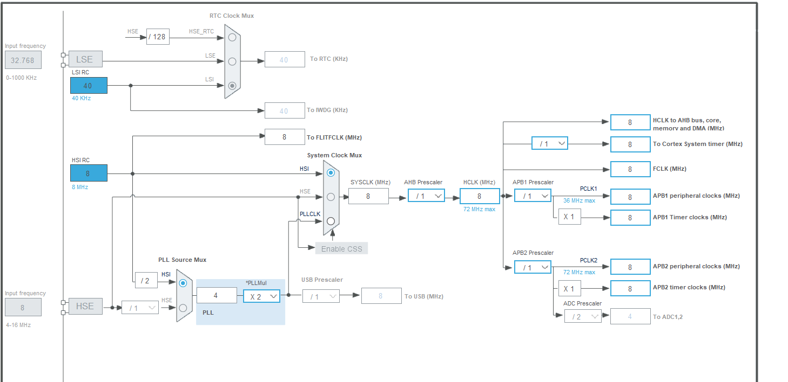
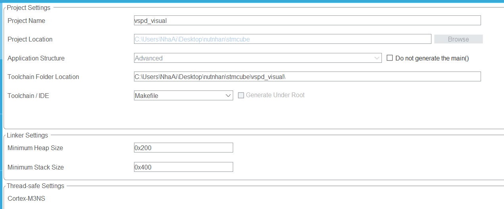
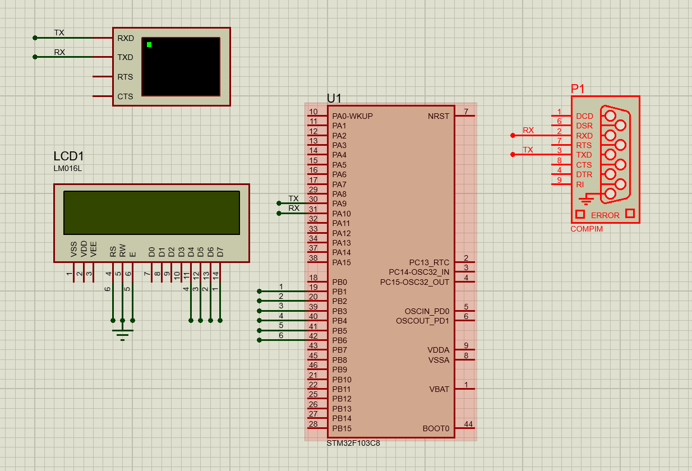
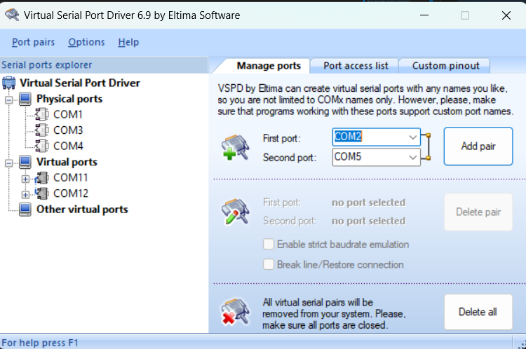
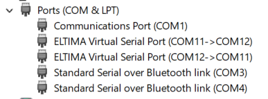
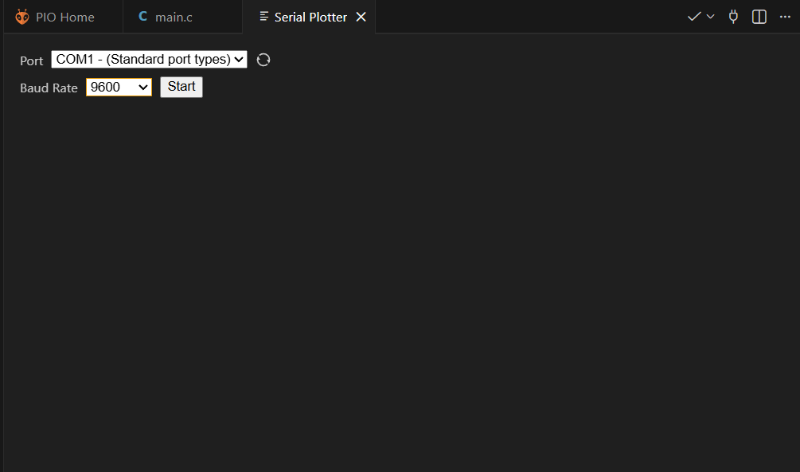
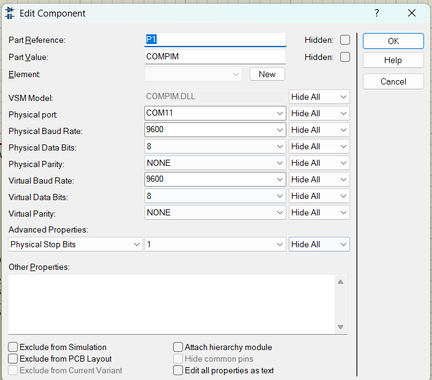
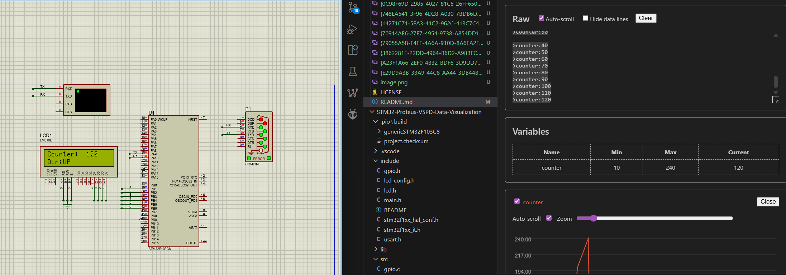
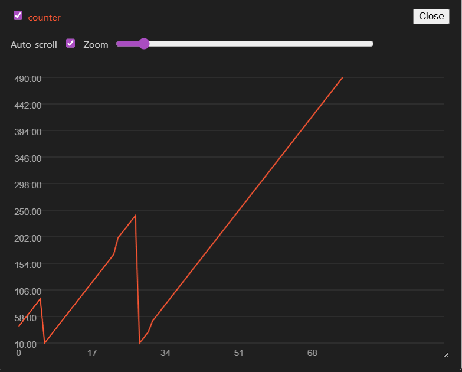

# 🛰️ STM32 Virtual HIL: UART Bridge to PC Plotter 📈

  
  
  
  

> **Hardware-in-the-Loop (HIL)** simulation project bridging embedded firmware with PC-side data visualization using Virtual Serial Ports.

---

### 🌟 Project Overview
This project demonstrates a complete integration workflow for embedded systems: from peripheral configuration and circuit simulation to establishing a virtual communication tunnel for real-time telemetry plotting.

---

### 🛠 Development Workflow (Step-by-Step)

#### **1️⃣ Peripheral Configuration ⚡ (STM32CubeMX)**
- Initialized the system clock and configured **GPIOs** for LCD control.
- Enabled **UART1** peripheral (115200-8-N-1) for high-speed data transmission.
- Generated the base project using the **Makefile** toolchain for seamless integration with VS Code.

#### **2️⃣ Schematic Design & Virtual Prototyping 🧩 (Proteus)**
- Constructed the hardware model featuring the **STM32F103C8T6** microcontroller.
- Integrated a **16x2 LCD (LM016L)** for local status display.
- Implemented the **COMPIM** module to act as the physical-to-virtual serial gateway.

#### **3️⃣ Firmware Migration 🏗️ (VS Code & PlatformIO)**
- Migrated the CubeMX-generated source files into the **PlatformIO** environment.
- Mapped the `include/` and `src/` directories to ensure full compatibility with the STM32 HAL drivers.
- Optimized the build process for real-time simulation debugging.

#### **4️⃣ Virtual Communication Tunneling 🔗 (VSPD)**
- Utilized **Virtual Serial Port Driver (VSPD)** to create a dedicated null-modem bridge (e.g., **COM1 ↔ COM2**).
- Linked the Proteus COMPIM module to the virtual bridge, enabling wireless data tunneling within the OS.

#### **5️⃣ Real-time Data Visualization 📊 (Serial Plotter)**
- Connected the VS Code **Serial Plotter** to the receiving end of the virtual bridge (**COM2**).
- Successfully visualized real-time UART telemetry streams into dynamic graphical plots.

Preview:

---